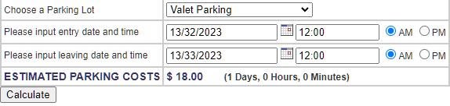

#### BUGS-ID

BUGS-01

#### Title

The calculator still counting if I input an invalid date in all parking lot

#### Severity

Major

#### Priority

High

#### Steps to reproduce

1. Go to <https://www.shino.de/parkcalc/index.php>
2. Choose a Parking Lot
3. Input entry date = 13/32/2023
4. Input leaving date = 13/33/2023
5. Click Calculate

#### Current behaviour

The estimated parking costs shows the cost

#### Expected behaviour

The estimated parking costs didn't shows the cost ($0)

#### Relevant logs and/or screenshots

#### Comment/Notes

The estimated parking costs didn't shows the cost ($0) or showing the error message

#### Reported by

Ahmad Waskita
