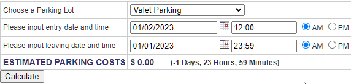

#### BUGS-ID

BUGS-03

#### Title

Valet parking won't show the error message if user input a specific time

#### Severity

Minor

#### Priority

Low

#### Steps to reproduce

1. Go to <https://www.shino.de/parkcalc/index.php>
2. Choose a Parking Lot
3. Input entry date = 01/02/2023 12:00 AM
4. Input leaving date = 01/01/2023 11:59 PM
5. Click Calculate

#### Current behaviour

Valet parking won't show the error message if user input a specific time : less than - 2 Days, 0 Hours, 0 Minutes, more than - 1 Days, 0 Hours, 0 Minutes

#### Expected behaviour

All parking lot showing this error message "ERROR! YOUR LEAVING DATE OR TIME IS BEFORE YOUR STARTING DATE OR TIME"

#### Relevant logs and/or screenshots

#### Comment/Notes

#### Reported by

Ahmad Waskita
